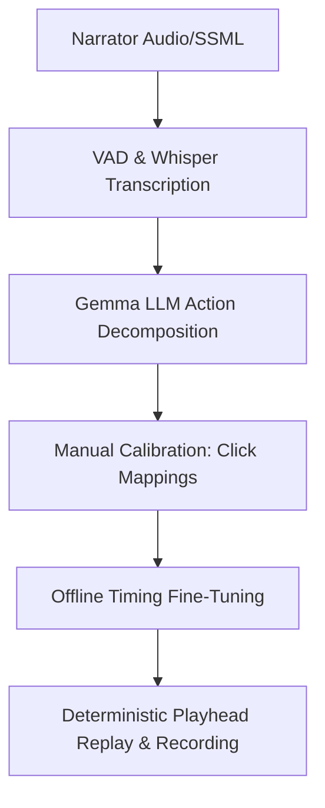

# Project Summary: Voice-Driven Browser Walkthrough Compiler

This document summarizes the core architecture, key design decisions, and final outcomes of our work on the voice-guided browser automation and recording tool.

---

## 1. Project Objective
To build an automated, zero-marginal-cost pipeline that takes a high-quality voice narration (e.g., generated from SSML via ElevenLabs) and uses it to drive a real-time, perfectly synchronized browser automation demo and screen recording on device.

---

## 2. Key Architecture & Workflows

### Phase 1: Interactive Calibration (Done Once)
- **Goal**: Map voice segment transcripts to target CSS selectors/inputs in Google Chrome.
- **Implementation**: The user performs the actions interactively in Chrome. The Go script captures selector/click events via Chrome DevTools Protocol (CDP) bindings and records raw timestamps.

### Phase 2: Offline Timing Fine-Tuning (Automated)
- **Goal**: Refine action execution timings relative to the voice narration length without repeating manual walkthroughs.
- **Formula (Segment-End Spacing)**: 
  Multi-click actions (such as opening a dropdown and selecting an option) are spaced proportionally across the remaining duration of their speech segment (with a 1.5-second safety buffer at the end) rather than character-based step durations.

### Phase 3: Synchronized Replay & Screen Capture
- **Goal**: Render the final demo video.
- **Implementation**: The playback engine continuously checks the real-time audio playhead. Actions fire deterministically when the playhead crosses their optimized offsets. Chrome is launched with specific target URLs to prevent `-32000` (no browser open) errors.

---

## 3. Major Learnings & Guidelines
- **Decoupling Mapping from Timing**: Storing raw calibration offsets on disk allows timing updates to run in milliseconds offline.
- **Audio-Driven Playhead**: Real-time checking of the playhead resolves drift issues associated with static sleeps or blocked threads.
- **Low-Power Tuning**: On CPU-bound systems, capping FFmpeg recordings at 720p 30fps with the `ultrafast` preset preserves browser responsiveness.
